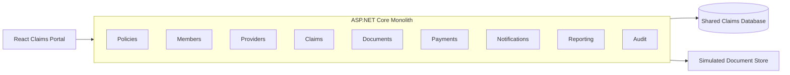
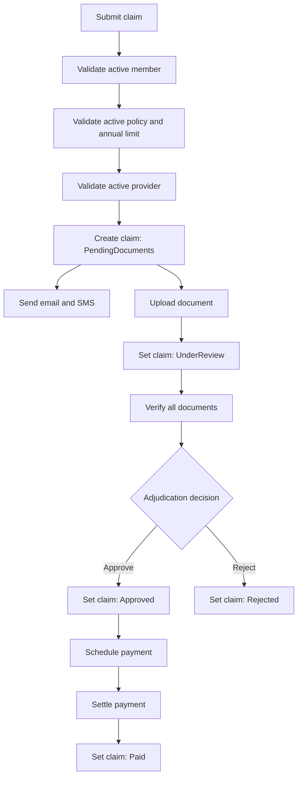

# Current-State Assessment

## Executive Summary

The system is a single ASP.NET Core deployment backed by one SQLite database.
It exposes distinct API areas for policies, members, providers, claims,
documents, payments, notifications, reporting, and audit, but those areas do
not have independent data ownership or deployment boundaries.

The code already uses controllers, application services, repositories, and a
unit of work. This is useful internal organization, but it does not remove the
runtime coupling created by synchronous workflows and the shared database.

## Deployment And Data Topology

All capabilities:

- run in one process;
- are registered in one dependency-injection container;
- use one `HealthCareClaimsDbContext`;
- commit through one `IUnitOfWork`;
- are released and scaled together;
- fail within the same runtime boundary.

## Primary Business Workflow

## Observed Coupling

### Claims Processing

`ClaimsWorkflowService` depends directly on:

- claims;
- members;
- policies;
- providers;
- documents;
- notifications;
- audit;
- the shared unit of work.

Claim submission therefore cannot complete if reference-data validation,
notification persistence, audit persistence, or the database transaction fails.

### Document Processing

`DocumentService` owns document operations but also:

- loads a claim;
- loads the member behind the claim;
- directly changes claim status to `UnderReview`;
- sends a notification;
- writes an audit entry.

Document processing is not autonomous because it mutates another capability's
state in the same transaction.

### Payment Processing

`PaymentService` owns payment operations but also:

- reads claim approval state;
- reads member contact information;
- directly changes claim status to `Paid`;
- sends notifications;
- writes audit entries.

The payment-to-claim transition has no explicit contract or event.

### Reporting

`ReportingService` reads snapshots and counts across policies, members,
providers, claims, documents, payments, and notifications. A reporting change
can therefore require knowledge of every operational data model.

### Shared Database

The shared `HealthCareClaimsDbContext` defines foreign keys across capability
boundaries:

- Member to Policy;
- Claim to Member;
- Claim to Provider;
- Document to Claim;
- Payment to Claim.

These database relationships provide consistency inside the monolith, but they
also prevent independent schema ownership and make extraction order important.

## Transaction Boundaries

Current commands use one database transaction boundary:

| Command | State changed together |
|---|---|
| Create policy | Policy and audit |
| Create member | Member and audit |
| Submit claim | Claim, two notifications, and audit |
| Upload document | Document, claim status, notification, and audit |
| Approve claim | Claim status, notification, and audit |
| Schedule payment | Payment, notification, and audit |
| Settle payment | Payment status, claim status, and audit |

These atomic transactions will not remain available after extraction. Later
designs must make failure, retry, idempotency, and eventual consistency
explicit.

## Current Strengths

- Business workflows are small enough to understand.
- Controllers do not access EF Core directly.
- Repository interfaces expose the current data dependencies.
- API endpoints already align broadly with business capabilities.
- The React portal is separated from the backend implementation.
- Seed data supports repeatable demonstrations.

## Modernization Risks

| Risk | Evidence | Consequence |
|---|---|---|
| Shared ownership | One DbContext contains all entities | Any capability can affect another capability's data |
| Synchronous chain | Claims calls notification and audit inline | Secondary failures can block core processing |
| Hidden state transitions | Documents and payments update Claim directly | Claim lifecycle rules are distributed |
| Cross-domain reads | Claims reads member, policy, provider, and document repositories | Extraction may create chatty synchronous calls |
| Reporting coupling | Reporting queries every operational area | Schema changes ripple into reports |
| Shared release | One executable hosts all capabilities | Small changes require full deployment |
| Shared scaling | One process handles every workload | Document or reporting load scales the whole system |

## Assessment Conclusion

The first modernization goal should be explicit business boundaries inside the
existing process. Service extraction should come later. A modular monolith can
make ownership, contracts, and event flows visible while preserving local
transactions during the learning and stabilization period.
