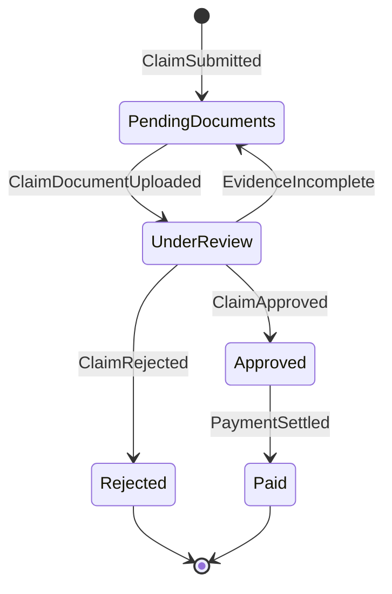

# Domain Events

## Event-Storming View

Commands are requests to perform work. Domain events are past-tense business
facts produced after successful work.

| Actor | Command | Rule or policy | Domain event | Likely reactions |
|---|---|---|---|---|
| Operations user or partner | Submit Claim | Member, policy, and provider must be eligible | `ClaimSubmitted` | Request documents, notify member, audit |
| Member or operations user | Upload Claim Document | Claim must exist | `ClaimDocumentUploaded` | Start review, notify member, audit |
| Reviewer | Verify Claim Document | Document must exist | `ClaimDocumentVerified` | Re-evaluate evidence completeness, audit |
| Reviewer | Reject Claim Document | Rejection reason should be captured | `ClaimDocumentRejected` | Request replacement evidence, audit |
| Claims examiner | Approve Claim | Required evidence must be verified | `ClaimApproved` | Make payment eligible, notify member, audit |
| Claims examiner | Reject Claim | Rejection reason is required | `ClaimRejected` | Notify member, audit |
| Payment operator or policy | Schedule Payment | Claim must be approved | `PaymentScheduled` | Notify member, audit |
| Settlement provider | Settle Payment | Payment must be scheduled | `PaymentSettled` | Mark claim paid, audit |
| Settlement provider | Fail Payment | Failure reason is required | `PaymentFailed` | Retry or manual intervention, audit |
| Policy administrator | Create Policy | Policy number must be unique | `PolicyCreated` | Audit, update read models |
| Enrollment administrator | Create Member | Active policy must exist | `MemberEnrolled` | Audit, update read models |
| Network administrator | Create Provider | Provider ID must be unique | `ProviderRegistered` | Audit, update read models |

## Claim Lifecycle



The code currently defines `Draft` and `Submitted` statuses but does not use
them in the implemented workflow. This should be resolved when the claim
aggregate is redesigned: either introduce commands that use those states or
remove them from the model.

## Event Payload Guidelines

Events should contain stable business identifiers and the facts required by
consumers. They should not expose EF Core entities.

Example conceptual event:

```json
{
  "eventId": "evt-...",
  "eventType": "ClaimApproved",
  "occurredAt": "2026-06-25T10:30:00Z",
  "claimNumber": "CLM-90001",
  "memberId": "MEM-1001",
  "approvedAmount": 16250,
  "currency": "INR",
  "version": 1
}
```

## Domain Events Versus Integration Events

During the modular-monolith stage:

- domain events can be raised and handled in-process;
- the originating transaction remains local;
- handlers update other modules through explicit contracts.

During service extraction:

- selected domain events become integration events;
- delivery uses an outbox and message broker;
- consumers must be idempotent;
- event contracts are versioned independently from internal domain models.

Not every internal event must be published outside its bounded context.

## Policies Revealed By Events

| When this happens | Then this policy may run |
|---|---|
| `ClaimSubmitted` | Request evidence and send submission acknowledgement |
| `ClaimDocumentUploaded` | Move the claim into review |
| All required evidence is verified | Allow adjudication |
| `ClaimApproved` | Make the claim eligible for payment scheduling |
| `PaymentSettled` | Mark the claim lifecycle as paid |
| Any business event | Append audit information |

These policies replace hidden cross-service state mutation with named business
reactions.

## Open Discovery Questions

- Which document types are mandatory for each claim type?
- Can a claim be partially approved?
- Can approval be reversed?
- Can a failed payment be rescheduled using the same payment identity?
- Does policy annual limit mean per member, family, year, or policy?
- Who owns accumulated benefit utilization?
- Is provider network status evaluated on service date or submission date?
- Which events require regulatory audit retention?

These questions should be answered with domain experts before the model is
treated as production-grade.
