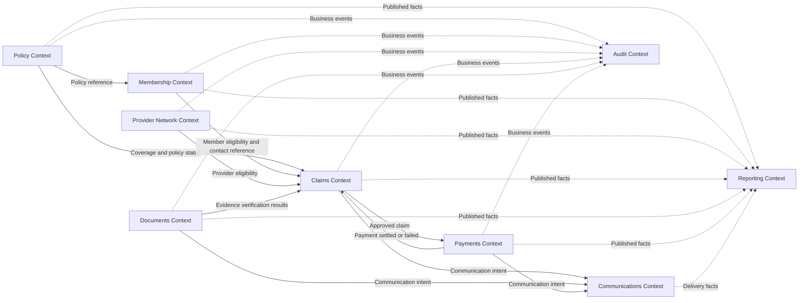

# Context Map

## Proposed Relationships

Solid arrows represent operational dependencies. Dotted arrows represent
downstream event or projection flows.

## Relationship Styles

| Upstream | Downstream | Relationship | Rationale |
|---|---|---|---|
| Policy | Membership | Customer/Supplier | Membership needs a stable policy reference |
| Policy | Claims | Open Host Service | Claims queries coverage and policy status through a defined contract |
| Membership | Claims | Open Host Service | Claims queries member eligibility through a defined contract |
| Provider Network | Claims | Open Host Service | Claims queries provider eligibility through a defined contract |
| Documents | Claims | Published Language | Evidence outcomes use explicit events or module contracts |
| Claims | Payments | Published Language | Approved claim becomes an explicit payment request |
| Payments | Claims | Published Language | Settlement outcome is returned as an event |
| Operational contexts | Communications | Published Language | Contexts send business communication intents |
| Operational contexts | Audit | Conformist consumer | Audit records published facts without controlling source models |
| Operational contexts | Reporting | Conformist consumer | Reporting builds downstream projections from published facts |

## Synchronous Versus Asynchronous Direction

### Initially Synchronous

During modularization, eligibility checks can remain synchronous:

- policy lookup;
- member lookup;
- provider lookup;
- document-status query during adjudication.

These calls must still pass through module contracts instead of repositories or
shared entities.

### Event-Driven Candidates

The following reactions do not need to block the originating command:

- notification delivery;
- audit recording;
- reporting projection updates;
- document-upload acknowledgement;
- payment-settlement propagation.

### Consistency Decision

Claim submission needs an eligibility decision at command time. Notification
delivery and reporting updates do not need to be transactionally atomic with the
claim. Payment settlement is financially important but can use eventual
consistency when supported by durable messaging, idempotency, and reconciliation.

## Anti-Corruption Layers

When a context is extracted, the remaining monolith should not consume its
internal API model directly. An adapter should translate between:

- the monolith's current concepts;
- the extracted context's public contract;
- versioned integration events.

This translation layer is especially important for Policy and Membership if
they later integrate with external insurer or enrollment systems.

## Frontend Position

The React portal is outside the context map because it is a client, not a domain
owner. It should call an API gateway or backend-for-frontend. During strangler
migration, the gateway routes each capability to either the monolith or an
extracted service while preserving stable client contracts.
