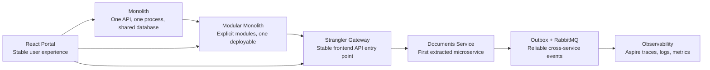
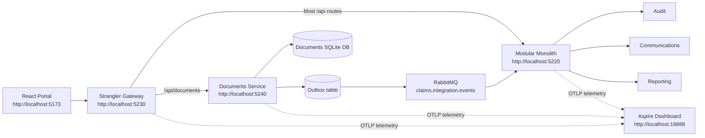

# ClaimSphere Healthcare Claims Modernization Playbook

This repository is a branch-by-branch modernization journey for a healthcare
claims platform. It starts with a simple monolith, introduces modular boundaries,
adds a strangler gateway, extracts the Documents capability into a microservice,
and then adds production-oriented integration patterns such as outbox,
RabbitMQ, observability, and a stable React frontend.

The important teaching idea is that modernization is incremental. The frontend
keeps calling the same business APIs while backend ownership changes behind the
gateway.

## Modernization Journey



## Repository Structure

```text
monolith/
  Original ASP.NET Core healthcare claims API.

modular-monolith/
  Modularized ASP.NET Core host with Policy, Membership, Provider Network,
  Claims, Documents, Payments, Communications, Audit, and Reporting modules.

gateway/
  Strangler gateway. The frontend calls this stable entry point while the
  gateway decides which backend owns each API route.

microservices/documents-service/
  Extracted Documents service using clean architecture, CQRS without MediatR,
  SQLite persistence, outbox, and RabbitMQ publishing.

frontend/healthcare-claims-portal/
  React portal reused across all modernization stages.

diagrams/
  Architecture and workflow diagrams used during the course.

modernization/
  Discovery notes and modernization documentation.

docker-compose.yml
  Local RabbitMQ and Aspire Dashboard dependencies.
```

## Architecture At The Latest Stage

At the latest stage, the application runs as multiple processes:



Runtime ownership:

- The frontend calls `/api/*`.
- The gateway receives the browser requests.
- `/api/documents` is routed to the extracted Documents service.
- Most other capabilities are still owned by the modular monolith.
- Documents service stores document data in its own SQLite database.
- Documents service writes integration events to its outbox.
- The outbox background publisher sends events to RabbitMQ.
- The modular monolith consumes document events and converts them into internal
  business events.
- Audit, Communications, and Reporting react through the modular monolith event
  bus.

## Stage 1: Monolith

The monolith is the starting point:

```text
React Portal -> Monolith API -> Shared SQLite database
```

It is intentionally simple:

- one ASP.NET Core API;
- one deployable process;
- one local SQLite database;
- all capabilities in the same application;
- direct workflow calls across claims, documents, payments, notifications, and
  reporting.

Run:

```powershell
dotnet run --project .\monolith\src\HealthCare.Claims.Monolith
```

Swagger:

```text
http://localhost:5213/swagger
```

Frontend:

```powershell
cd .\frontend\healthcare-claims-portal
npm install
npm run dev:monolith
```

Open:

```text
http://localhost:5173
```

## Stage 2: Modular Monolith

The modular monolith keeps one deployable application but introduces explicit
module boundaries:

```text
React Portal -> Modular Monolith API -> Module-owned services/repositories
```

The module set includes:

- Claims
- Policy
- Membership
- Provider Network
- Documents
- Payments
- Communications
- Audit
- Reporting

The key architectural rule is that modules do not reference each other directly.
They collaborate through BuildingBlocks contracts and in-process business
events.

Run:

```powershell
dotnet run --project .\modular-monolith\src\Api\HealthCare.Claims.ModularMonolith.Api
```

Swagger:

```text
http://localhost:5220/swagger
```

Frontend:

```powershell
cd .\frontend\healthcare-claims-portal
npm run dev:modular
```

## Stage 3: Strangler Gateway

The gateway introduces a stable API entry point:

```text
React Portal -> Strangler Gateway -> Modular Monolith
```

After the Documents capability is extracted:

```text
React Portal -> Strangler Gateway -> Modular Monolith
                                 -> Documents Service
```

The frontend continues to call the same `/api/*` URLs. The gateway route table
decides where each capability lives.

Run:

```powershell
dotnet run --project .\gateway\src\HealthCare.Claims.Gateway
```

Gateway diagnostics:

```text
http://localhost:5230/api/gateway/routes
http://localhost:5230/api/gateway/health
```

Frontend through the gateway:

```powershell
cd .\frontend\healthcare-claims-portal
npm run dev:gateway
```

## Stage 4: Extracted Documents Service

Documents is the first extracted service. It keeps the same external route:

```text
/api/documents
```

but the owner changes:

```text
Before: Modular Monolith Documents module
After:  Documents Service
```

The service uses a clean architecture shape:

```text
DocumentsService.Api
  Program.cs
  Endpoints/

DocumentsService.Application
  Abstractions/
  Commands/
  Queries/
  Handlers/
  DTOs/
  IntegrationEvents/

DocumentsService.Domain
  Entities/
  Enums/

DocumentsService.Infrastructure
  Persistence/
  Repositories/
  IntegrationEvents/
```

The application layer follows CQRS without MediatR:

- command records represent write requests;
- query records represent read requests;
- command handlers perform state changes;
- query handlers read data;
- endpoints depend on handler interfaces, not concrete infrastructure.

Run:

```powershell
dotnet run --project .\microservices\documents-service\src\HealthCare.Claims.DocumentsService.Api
```

Swagger:

```text
http://localhost:5240/swagger
```

## Stage 5: Cross-Service Events

Once Documents is extracted, the modular monolith still needs to react to
document activity. For example:

- document registered;
- document verified;
- document rejected.

The final event flow is:

```text
Documents Service
  -> SQLite outbox
  -> RabbitMQ
  -> Modular Monolith consumer
  -> In-process business event
  -> Audit, Communications, Reporting
```

RabbitMQ settings:

```text
Exchange: claims.integration.events
Routing key: documents.events
Queue: modular-monolith.documents
```

This teaches an important boundary rule:

```text
Integration events cross service boundaries.
Business events stay inside a process.
```

## Stage 6: Observability And Resilience

The latest branch adds OpenTelemetry instrumentation and sends telemetry to the
Aspire Dashboard.

The local dependencies are intentionally small:

```text
RabbitMQ
Aspire Dashboard
```

Start them:

```powershell
docker compose up -d
```

Open:

```text
RabbitMQ Management: http://localhost:15672
Aspire Dashboard:   http://localhost:18888
```

RabbitMQ login:

```text
guest / guest
```

The Aspire Dashboard container currently uses:

```text
mcr.microsoft.com/dotnet/aspire-dashboard:9.0
```

That is acceptable even when the application projects target .NET 10 because the
apps send telemetry through OTLP. The dashboard runtime does not need to match
the application runtime exactly.

## Full Local Run

Use this flow for the latest stage.

### 1. Start Local Infrastructure

```powershell
docker compose up -d
```

### 2. Start Modular Monolith

```powershell
dotnet run --project .\modular-monolith\src\Api\HealthCare.Claims.ModularMonolith.Api
```

Check:

```text
http://localhost:5220/api/platform/modules
http://localhost:5220/swagger
```

### 3. Start Documents Service

```powershell
dotnet run --project .\microservices\documents-service\src\HealthCare.Claims.DocumentsService.Api
```

Check:

```text
http://localhost:5240/swagger
http://localhost:5240/api/storage
http://localhost:5240/api/outbox
```

### 4. Start Gateway

```powershell
dotnet run --project .\gateway\src\HealthCare.Claims.Gateway
```

Check:

```text
http://localhost:5230/api/gateway/routes
http://localhost:5230/api/gateway/health
```

### 5. Start Frontend

```powershell
cd .\frontend\healthcare-claims-portal
npm run dev:gateway
```

Open:

```text
http://localhost:5173
```

The sidebar should show:

```text
Strangler gateway connected
```

## End-To-End Test Through Gateway

Trigger document creation through the gateway:

```http
POST http://localhost:5230/api/documents
Content-Type: application/json

{
  "claimNumber": "CLM-202606270001",
  "documentType": "DiagnosticReport",
  "fileName": "gateway-upload-diagnostics.pdf",
  "storageReference": "local://claims/CLM-202606270001/gateway-upload-diagnostics.pdf",
  "notes": "Uploaded through strangler gateway."
}
```

Verify the document exists in the extracted service:

```http
GET http://localhost:5240/api/documents?claimNumber=CLM-202606270001
```

Verify the outbox published the integration event:

```http
GET http://localhost:5240/api/outbox
```

Verify the modular monolith consumed the event:

```http
GET http://localhost:5220/api/audit?module=Documents
GET http://localhost:5220/api/notifications
GET http://localhost:5220/api/reports/operations
```

Verify the broker:

```http
GET http://localhost:5220/api/integration-events/documents/broker
```

Expected request journey:

```text
React or HTTP client
  -> Gateway
  -> Documents Service
  -> Documents SQLite database
  -> Outbox table
  -> RabbitMQ
  -> Modular Monolith consumer
  -> Internal business event
  -> Audit, Notifications, Reporting
```

## Aspire Trace Walkthrough

Use the Aspire Dashboard to explain one complete request:

1. Open `http://localhost:18888`.
2. Select **Traces**.
3. Trigger `POST http://localhost:5230/api/documents`.
4. Open the latest `POST /api/documents` trace.
5. Explain the spans in this order:

```text
Gateway receives the HTTP request
Gateway forwards to Documents Service
Documents Service saves document data
Documents Service creates an outbox message
Outbox publisher sends the event to RabbitMQ
Modular Monolith consumes the brokered event
Modular Monolith publishes an internal business event
Audit, Communications, and Reporting update their projections
```

Use structured logs as supporting evidence, but use traces for the end-to-end
story.

## Frontend Role

The React portal is deliberately stable across the course:

```text
frontend/healthcare-claims-portal
```

It can run against different backend stages:

```powershell
npm run dev:monolith
npm run dev:modular
npm run dev:gateway
```

This is the main frontend modernization lesson:

```text
The user experience does not need to be rewritten just because backend
ownership changes.
```

The frontend remains focused on claims operations. The backend architecture
evolves behind the API contract.

## Useful URLs

```text
Frontend portal:        http://localhost:5173
Monolith Swagger:       http://localhost:5213/swagger
Modular Swagger:        http://localhost:5220/swagger
Gateway diagnostics:    http://localhost:5230/api/gateway/routes
Documents Swagger:      http://localhost:5240/swagger
RabbitMQ Management:    http://localhost:15672
Aspire Dashboard:       http://localhost:18888
```

## Detailed READMEs

For deeper branch-specific notes, use:

```text
monolith/README.md
modular-monolith/README.md
gateway/README.md
microservices/documents-service/README.md
frontend/README.md
diagrams/README.md
```

This root README is the map. The folder READMEs are the detailed walkthroughs.
